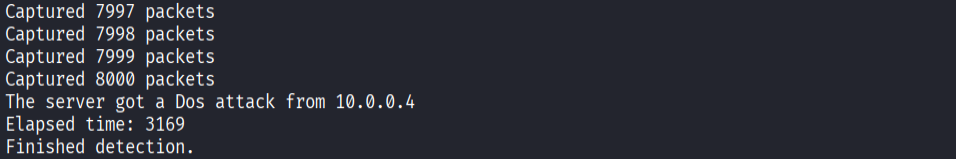
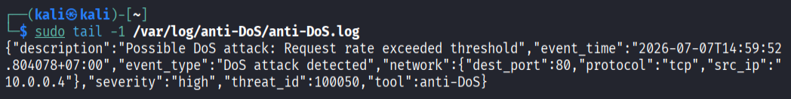
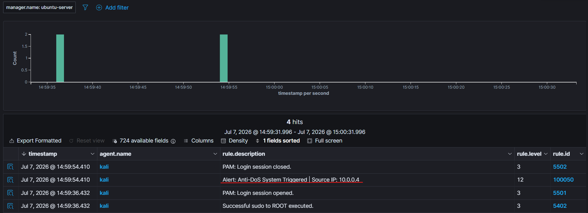
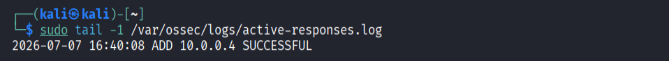
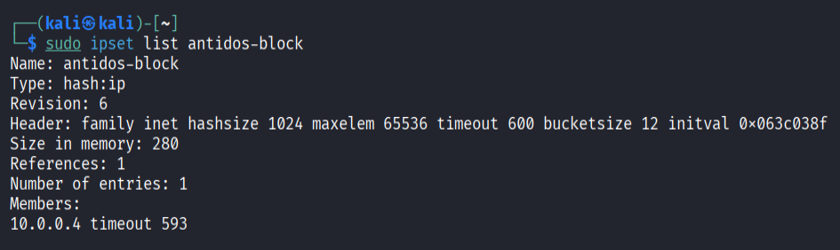
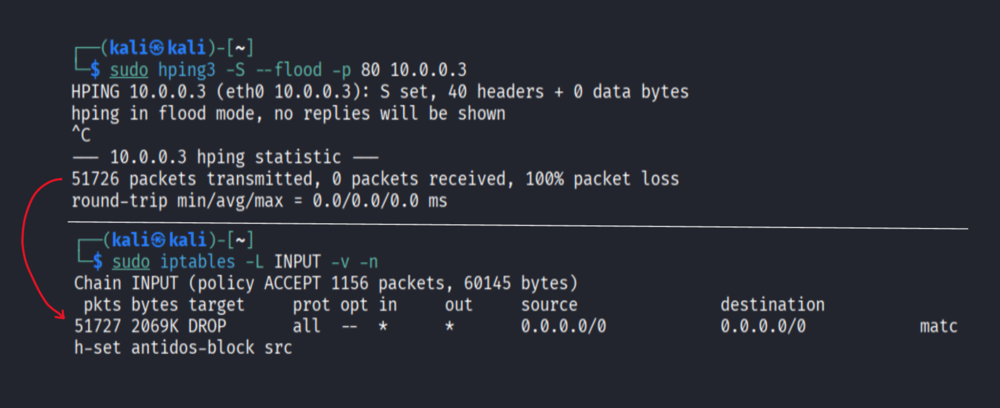
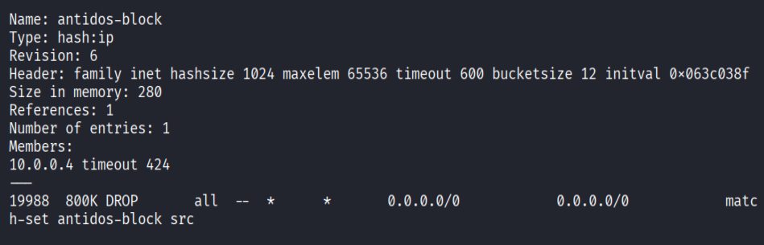

# Wazuh Active-Response Based Anti-DoS Monitoring and Mitigation System
## Introduction
Anti-DoS is a tool designed to help solve the problem of Denial of Service (DoS) attacks. It protects agents in the internal network, which are monitored by the Wazuh system, from having their system resources overloaded.

## Idea
The Anti-DoS system is an automated monitoring and mitigation solution designed to counter Denial-of-Service (DoS) attacks. It integrates a custom packet capture utility with the Wazuh Active-Response capability (utilizing `iptables` and `ipset`).

The system architecture and workflow operate as follows:

1. **Traffic Detection and Analysis:** A custom utility leveraging the `pcap` library captures network packets and tracks incoming traffic volume per source IP using a Hash Table data structure. Anomalous behavior—simulated via `hping3` with `-S --flood` flags—is identified when an IP exceeds a predefined threshold (an empirical baseline of $8000 \text{ packets} / 10\text{s}$ was utilized, subject to further calibration).
2. **Logging and Alerting:** Upon threshold violation, the utility logs the event into `anti_DOS.log`. The Wazuh Manager is configured via `ossec.conf` to monitor this log file in real-time. Once a new log entry is detected, it triggers a corresponding alert on the Wazuh Dashboard.
3. **Automated Mitigation (Active-Response):** Upon alert generation, the Wazuh Manager forwards the event payload in JSON format via `stdin` to a configured Active-Response bash script named `ipset-block.sh`. This script parses the target IP from the JSON payload, invokes `iptables` to drop the malicious traffic, and appends the IP to an `ipset` group. The blocked IP is automatically unbanned after a default TTL (Time-To-Live) of 600 seconds.

## Demo
- First, the DoS detection tool detects an abnormal flow rate from a malicious IP:

- The event is then logged in a configured log file:

The Wazuh manager continuously monitors the log file and triggers an alert whenever a new log entry indicating a DoS attack is recorded:

- After the alert is fired, the Wazuh Active-Response module is triggered and calls the configured script, which contains the commands to add the malicious IP to ipset. This action is also recorded in `active-responses.log`, making it easy to trace back why an IP was blocked:

- The malicious IP has been add into ipset:

- Finally, iptables reads from ipset to determine which IPs are malicious and blocks them (all 51,727 packets were blocked; a difference of 1 packet may occur due to network latency, which is normal):


## Features
N/A
## Installation
### Install Wazuh system
Because the system runs on Wazuh, you need to [install](https://documentation.wazuh.com/current/installation-guide/index.html) it first.
### Configure in manager:
- First we need to configure **local rules** for the manager. Open the file `/var/ossec/etc/rules/local_rules.xml` and add the rule below to the end of the file:
```
<group name="anti_DOS">
  <rule id="100050" level="12">
    <decoded_as>json</decoded_as>
    <field name="event_type">DOS attack detected</field>
    <description>Alert: Anti-DoS System Triggered | Source IP: $(network.src_ip)</description>
  </rule>
</group>
```
- The source IP is read from the log file sent by the agents.  
Next, we need to set up the **active-response** module by adding the following configuration to `/var/ossec/etc/ossec.conf`:
```
<command>
    <name>ipset-block</name>
    <executable>ipset-block.sh</executable>
    <timeout_allowed>yes</timeout_allowed>
</command>

<active-response>
    <disabled>no</disabled>
    <command>ipset-block</command>
    <location>defined-agent</location>
    <agent_id>002</agent_id>
    <rules_id>100050</rules_id>
    <timeout>600</timeout>
</active-response>
```
- The `<location>` block represents which systems the command should be executed on (`defined-agent` means the command runs on a specific agent identified by `<agent_id>`).
- The `<name>` block inside `<command>`, and the `<command>` block inside `<active-response>`, must match each other, because when active-response is triggered, it uses this reference to determine which file in `<executable>` to run.
- The `<rules_id>` is the ID assigned based on the rule defined in `local_rules.xml`.
- The `<timeout>` defines when an IP is unblocked from `ipset`.  
Remember to restart the **wazuh-manager** service after configuring:
```
systemctl restart wazuh-manager
```
### Configure in agents
First, we need to specify a location where `anti_DOS.cpp` can write its logs, and where wazuh-agent can read them before sending them to the manager. In this case, the location is `/var/log/anti_DOS/anti_DOS.log`. Add the following configuration to `/var/ossec/etc/ossec.conf`:
```
<ossec_config>
    <localfile>
        <log_format>json</log_format>
        <location>/var/log/anti_DOS/anti_DOS.log</location>
        <only-future-events>yes</only-future-events>
    </localfile>
</ossec_config>
```
Remember to grant read and write permissions on `anti_DOS.log` to the owner:
```
chmod 644 /var/log/anti_DOS/anti_DOS.log
```
Create a script to automatically block malicious IP(s) in ```/var/ossec/active-response/bin/```.
You can see the script in [ipset-block.sh](tools/anti_DOS/wazuh-integration/agents/active-response/ipset-block.sh).  
Configure access right for wazuh: 
```
chown root:wazuh /var/ossec/active-response/bin/ten_script_cua_ban.sh
```
Remember to restart the **wazuh-agent** service after configuring:
```
systemctl restart wazuh-agent
```
### Create an ipset in agents
**ipset** is a utility tool that accompanies the **iptables** firewall on Linux, allowing administrators to store and manage groups of IP addresses, network ranges, ports (TCP/UDP), or MAC addresses as a single set.  
If `ipset` is not installed on the agents, use the command below in the terminal:
```
sudo apt install ipset
```
Create a new **ipset**; in this case, we name it `antidos-block`:
```
sudo ipset create antidos-block hash:ip timeout 600
```
- The timeout value can be changed based on your needs.  
### Configure iptables firewall in agents
Create an iptables rule that references this ipset:
```
sudo iptables -I INPUT -m set --match-set antidos-block src -j DROP
```
This immediately inserts a rule at the top of the firewall chain (`-I INPUT`): whenever an incoming packet has a source IP (`src`) listed in `antidos-block`, it is dropped (`DROP`) immediately—no questions asked.  
### Configure for ipset and iptables after each reboot
Because iptables firewall rules only exist in RAM, all firewall rules are cleared whenever the agent reboots. So we need to install a service called `netfilter-persistent`, which allows us to save the firewall rules to a file before rebooting.  
Install the `netfilter-persistent` service first:
```
sudo apt-get install iptables-persistent
```
When installing```iptables-persistent```, the ```netfilter-persistent``` service is loaded along with it.  
Then save the iptables firewall rules (you need to do this at least once before rebooting):
```
sudo netfilter-persistent save
```
After running this command, all firewall rules are saved in `/etc/iptables/rules.v4` (for IPv4) and `rules.v6` (for IPv6). When the agent is rebooted, `netfilter-persistent.service` (managed by systemd) automatically runs `iptables-restore < /etc/iptables/rules.v4` and loads those rules into the kernel before startup.  
We should not persist the state of ipset across reboots. Instead, a new ipset should be created empty (containing no IPs) each time, to avoid inadvertently blocking IPs that have already been unblocked due to timeout expiration. To create a service that automatically generates a new ipset after each reboot and loads the iptables rules, run the commands below in the terminal:
```
sudo bash -c "cat << 'EOF' > /etc/systemd/system/ipset-restore.service
[Unit]
Description=Restore ipset rules
# Run before firewall to avoid lack of ipset
Before=netfilter-persistent.service iptables.service

[Service]
# Run one time when agent booting
Type=oneshot
RemainAfterExit=yes
# Init ipset configuration anti-DoS
ExecStart=/sbin/ipset create antidos-block hash:ip timeout 600 -exist

[Install]
WantedBy=multi-user.target
EOF"
```
Enable the service:
```
sudo systemctl daemon-reload
sudo systemctl enable ipset-restore.service
```
Enable `netfilter-persistent` service:
```
sudo systemctl enable netfilter-persistent
```
### Clone the repo into agents
After completing the Wazuh installation, clone this repo:
```
git clone git@github.com:khainguyendiep/Leukocyte.git
```
## Running
Go to the repo directory:
```
cd Leukocyte
```
Compile the anti_DOS tool (it might also compile other tools, but don't worry about that!):
```
make
```
Before running, make sure **wazuh-manager**, **wazuh-dashboard**, and **wazuh-indexer** are active on the manager machine:
```
sudo systemctl status wazuh-manager wazuh-dashboard wazuh-indexer
```
And that **wazuh-agent** is active on the agent machines:
```
sudo systemctl status wazuh-agent
```
If everything has status **active (running)**, go to the next step.    
Run the anti_DOS tool to start capturing packets:
```
sudo ./anti_DOS
```
If the condition described in [Traffic Detection and Analysis](#idea) is met, the blocking process will start. Check the result of the blocking using:
```
sudo watch -n1 'ipset list antidos-block; echo "---"; iptables -L INPUT -v -n | grep match-set'
``` 
If the upper command doesn't show anything at all, open another terminal and restart wazuh-agent:
```
sudo systemctl restart wazuh-agent
```
The result is in the form of:

## Acknowledgements
- [uthash.h](https://github.com/troydhanson/uthash/blob/2031adfd8cd6f8f498e0f4a9055648b19496f12e/src/uthash.h) - A library for creating and managing hash tables for character arrays, developed by [Troy D. Hanson](https://github.com/troydhanson) and community.
- [nlohmann-json](https://github.com/nlohmann/json) - Export json file, developed by [Niels Lohmann](https://github.com/nlohmann) and community.
## License
- This project is licensed under the **MIT License** - see the [LICENSE](https://github.com/khainguyendiep/Leukocyte/blob/main/LICENSE) file for details.
## Third-party Licenses
This project incorporates code from:
- [Troy D. Hanson](https://github.com/troydhanson) licensed under the BSD License.
